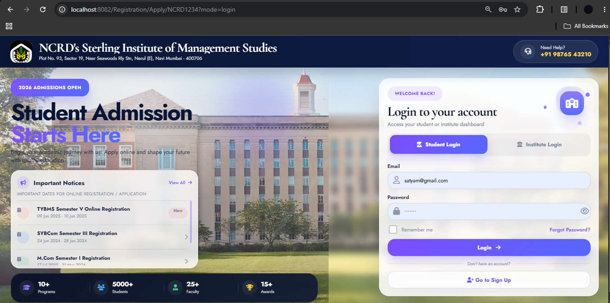
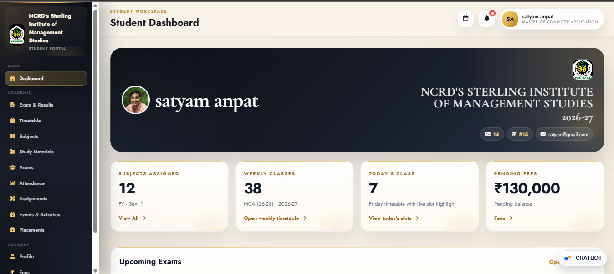
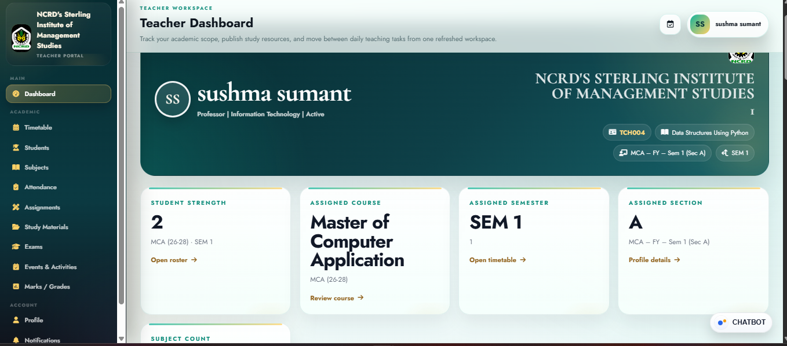
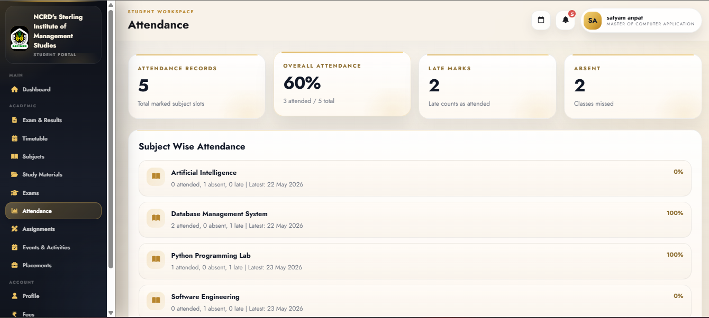
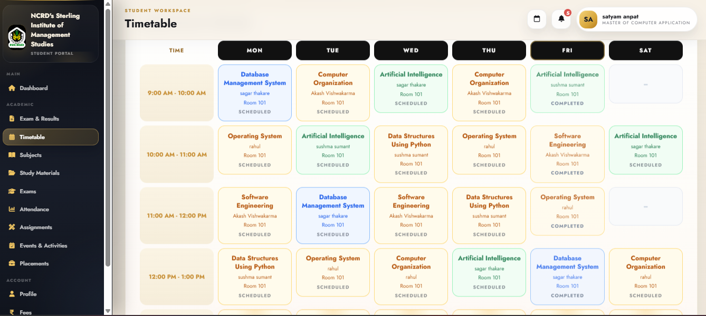
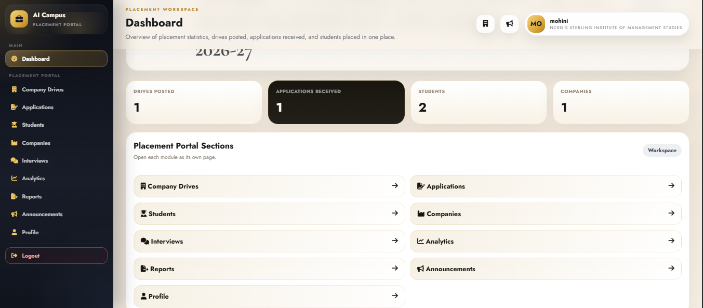

# 🎓  Smart Campus Management System (SCMS)

> A Java Full Stack web application for digitizing and streamlining academic, administrative, attendance, examination, timetable, document, and placement activities within an educational institution.

[](https://www.oracle.com/java/)
[](https://spring.io/projects/spring-boot)
[](https://spring.io/projects/spring-security)
[](https://hibernate.org/)
[](https://www.mysql.com/)
[](https://maven.apache.org/)
[](https://git-scm.com/)

---

## 📌 Table of Contents

* [About the Project](#-about-the-project)
* [Problem Statement](#-problem-statement)
* [Project Objectives](#-project-objectives)
* [Key Features](#-key-features)
* [Modules](#-modules)
* [User Roles](#-user-roles)
* [Technology Stack](#-technology-stack)
* [Application Architecture](#-application-architecture)
* [Project Structure](#-project-structure)
* [Database](#-database)
* [Security](#-security)
* [AI and Smart Features](#-ai-and-smart-features)
* [Prerequisites](#-prerequisites)
* [Installation and Setup](#-installation-and-setup)
* [Configuration](#-configuration)
* [Running the Application](#-running-the-application)
* [Application Workflow](#-application-workflow)
* [Screenshots](#-screenshots)
* [Future Enhancements](#-future-enhancements)
* [Learning Outcomes](#-learning-outcomes)
* [Developer](#-developer)
* [License](#-license)

---

## 🚀 About the Project

The **AI-Powered Smart Campus Management System (SCMS)** is a Java Full Stack web application developed to provide a centralized digital platform for managing different academic and campus-related activities.

Traditional educational institutions often use separate systems, spreadsheets, paper-based processes, and manual communication for activities such as attendance, examinations, fees, study materials, documents, timetables, and placements.

SCMS aims to bring these activities together into a single web-based platform.

The system provides role-based access for different users and allows each role to access the features and information relevant to them.

---

## ❗ Problem Statement

Educational institutions manage a large amount of academic and administrative information every day.

Common challenges include:

* Manual attendance management
* Fragmented academic information
* Difficulty managing timetables
* Manual examination processes
* Scattered study materials
* Document management problems
* Time-consuming placement coordination
* Lack of centralized student information
* Repetitive administrative work
* Limited automation in campus operations

SCMS addresses these challenges by providing a centralized and secure web application.

---

## 🎯 Project Objectives

The major objectives of the project are:

1. Digitize campus management activities.
2. Centralize academic and student information.
3. Reduce repetitive manual work.
4. Improve attendance management.
5. Simplify examination management.
6. Provide centralized access to study materials and documents.
7. Improve timetable management.
8. Support placement and TPO activities.
9. Provide role-based access control.
10. Introduce AI-oriented features for smarter campus operations.
11. Provide a scalable foundation for future campus automation.

---

# ✨ Key Features

## 👨‍🎓 Student Management

Students can access and manage their campus-related information through a centralized dashboard.

Features include:

* Student dashboard
* Student profile
* Academic information
* Attendance information
* Examination information
* Timetable
* Study materials
* Fee information
* Documents
* Digital ID
* Placement information
* Campus chatbot

---

## 👨‍🏫 Teacher Management

The teacher module provides tools for managing academic activities.

Features include:

* Teacher dashboard
* Student information
* Attendance management
* Examination-related activities
* Timetable access
* Study material management
* Academic information
* Document-related activities

---

## 💼 Placement / TPO Management

The placement module is designed to simplify placement-related activities.

Features include:

* Company information
* Placement opportunities
* Student placement records
* Job information
* Student eligibility information
* Placement tracking
* TPO-oriented management

---

## 📝 Attendance Management

The attendance module is designed to provide centralized attendance management.

The system can support:

* Student attendance records
* Teacher-side attendance management
* Attendance tracking
* Attendance status
* Attendance-related reporting
* Automated attendance concepts

---

## 📚 Study Material Management

Students can access academic learning resources from a centralized platform.

The module supports:

* Study material organization
* Subject-related resources
* Faculty-provided materials
* Centralized access to academic resources

---

## 📝 Examination Management

The examination module helps organize examination-related information.

It can include:

* Examination schedules
* Subject information
* Student examination details
* Academic examination records

---

## 💰 Fee Management

The system provides centralized access to student fee-related information.

Features include:

* Fee information
* Payment-related records
* Student fee status
* Centralized fee management

---

## 🗓️ Timetable Management

The timetable module is designed to simplify timetable creation and management.

Smart timetable capabilities include:

* Subject scheduling
* Faculty assignment
* Room allocation
* Lab scheduling
* Faculty conflict detection
* Room conflict detection
* Timetable automation concepts
* Academic batch and division management

---

## 📄 Document Management

SCMS provides centralized management of academic and campus documents.

The system can handle document-related operations using Java libraries such as:

* Apache POI
* Apache PDFBox

---

## 🪪 Digital Student ID

The system includes a digital identity concept for students, allowing student information to be represented digitally within the application.

---

# 🤖 AI and Smart Features

The project includes AI-oriented and automation-focused features intended to make campus operations smarter.

## 💬 AI Campus Chatbot

The chatbot provides an interactive interface for campus-related assistance.

Possible use cases include:

* Academic information
* Campus information
* Student assistance
* Frequently asked questions
* Navigation to campus services

---

## 👤 AI-Based Facial Recognition Attendance

The project includes an AI-based attendance concept involving facial recognition.

The intended workflow can include:

```text
Student
   ↓
Face Detection
   ↓
Face Recognition
   ↓
Liveness Verification
   ↓
Location / Geofence Validation
   ↓
Attendance Verification
   ↓
Attendance Record
```

---

## 🛡️ Liveness Verification

Liveness verification is intended to reduce attendance fraud by determining whether the detected face belongs to a live person rather than a static photograph.

---

## 📍 Geofence-Based Attendance

Geofencing can be used as an additional validation layer to ensure attendance is performed from an authorized campus/location area.

---

## 🧠 Smart Timetable

The timetable module can be enhanced with intelligent scheduling logic to detect conflicts involving:

* Faculty
* Rooms
* Labs
* Subjects
* Time slots
* Divisions

---

# 🧩 Modules

The overall system is organized into multiple modules:

```text
AI-Powered SCMS
│
├── Authentication & Authorization
│
├── Student Module
│
├── Teacher Module
│
├── Attendance Module
│
├── Examination Module
│
├── Fee Module
│
├── Timetable Module
│
├── Study Material Module
│
├── Document Module
│
├── Digital ID Module
│
├── Placement / TPO Module
│
├── AI Chatbot
│
└── Smart Automation Features
```

---

# 👥 User Roles

| Role               | Main Responsibilities                                                                |
| ------------------ | ------------------------------------------------------------------------------------ |
| 👨‍🎓 Student      | Attendance, examinations, timetable, fees, study materials, documents and placements |
| 👨‍🏫 Teacher      | Attendance, academic activities, examinations, timetable and study materials         |
| 💼 TPO / Placement | Companies, job opportunities, eligibility and placement records                      |
| 🔐 Super Admin     | System-level management and administration                                           |

---

# 🛠️ Technology Stack

## Backend

* **Java 17**
* **Spring Boot**
* **Spring MVC**
* **Spring Security**
* **Spring Data JPA**
* **Hibernate**
* **REST APIs**
* **Maven**

## Frontend

* **HTML5**
* **CSS3**
* **JavaScript**
* **Thymeleaf**
* **Tailwind CSS**

## Database

* **MySQL**

## Libraries / Tools

* Apache POI
* Apache PDFBox
* JWT
* Git
* GitHub

---

# 🏗️ Application Architecture

The application follows a layered architecture based on Spring Boot.

```text
                    ┌─────────────────────────┐
                    │       User / Client     │
                    └────────────┬────────────┘
                                 │
                                 ▼
                    ┌─────────────────────────┐
                    │       Frontend          │
                    │ HTML / CSS / JS         │
                    │ Thymeleaf               │
                    └────────────┬────────────┘
                                 │
                                 ▼
                    ┌─────────────────────────┐
                    │     Spring MVC          │
                    │      Controllers        │
                    └────────────┬────────────┘
                                 │
                                 ▼
                    ┌─────────────────────────┐
                    │       Service Layer     │
                    │     Business Logic      │
                    └────────────┬────────────┘
                                 │
                                 ▼
                    ┌─────────────────────────┐
                    │     Repository Layer    │
                    │ Spring Data JPA         │
                    │ Hibernate                │
                    └────────────┬────────────┘
                                 │
                                 ▼
                    ┌─────────────────────────┐
                    │        MySQL            │
                    │        Database         │
                    └─────────────────────────┘
```

---

# 📂 Project Structure

The project follows a standard Spring Boot/Maven structure.

```text
AI-Powered-SCMS/
│
├── src/
│   ├── main/
│   │   ├── java/
│   │   │   └── ...
│   │   │
│   │   └── resources/
│   │       ├── static/
│   │       │   ├── css/
│   │       │   ├── js/
│   │       │   └── images/
│   │       │
│   │       ├── templates/
│   │       │   └── ...
│   │       │
│   │       └── application.properties
│   │
│   └── test/
│
├── pom.xml
├── README.md
├── .gitignore
└── ...
```

---

# 🗄️ Database

The application uses **MySQL** as its relational database.

The database is accessed using:

```text
Spring Data JPA
        ↓
Hibernate ORM
        ↓
MySQL
```

JPA and Hibernate are used to map Java entities to relational database tables.

---

# 🔐 Security

Security is implemented using **Spring Security**.

The application uses role-based authorization to control access to different parts of the system.

Security-related functionality includes:

* Authentication
* Authorization
* Role-based access control
* Protected application endpoints
* Secure session handling
* Password protection
* User access restrictions

---

# 📦 Maven

Maven is used as the project's build and dependency management tool.

### Clean the project

```bash
mvn clean
```

### Compile the project

```bash
mvn compile
```

### Build the project

```bash
mvn clean install
```

### Run the application

```bash
mvn spring-boot:run
```

---

# ⚙️ Prerequisites

Before running the project, make sure the following software is installed:

### Required

* Java JDK 17+
* Maven
* MySQL
* Git

### Recommended IDEs

* IntelliJ IDEA
* Eclipse
* Visual Studio Code

---

# 📥 Installation and Setup

## 1. Clone the Repository

```bash
git clone https://github.com/vishwajit-2001/AI-Powered-SCMS.git
```

Navigate to the project:

```bash
cd AI-Powered-SCMS
```

---

## 2. Configure MySQL

Start your MySQL server and create the database.

Example:

```sql
CREATE DATABASE scms;
```

---

## 3. Configure Database Credentials

Open:

```text
src/main/resources/application.properties
```

Configure your local database connection.

Example:

```properties
spring.datasource.url=jdbc:mysql://localhost:3306/scms
spring.datasource.username=YOUR_USERNAME
spring.datasource.password=YOUR_PASSWORD

spring.jpa.hibernate.ddl-auto=update
spring.jpa.show-sql=true
```

Replace:

```text
YOUR_USERNAME
YOUR_PASSWORD
```

with your local MySQL credentials.

> ⚠️ Do not upload real passwords, API keys, JWT secrets, or other sensitive credentials to GitHub.

---

# ▶️ Running the Application

After configuring the database, build the application:

```bash
mvn clean install
```

Run the application:

```bash
mvn spring-boot:run
```

Or run the main Spring Boot application class directly from your IDE.

If your application is configured to use port `8082`, open:

```text
http://localhost:8082
```

If you have configured another port, use that port instead.

---

# 🔄 Application Workflow

```text
                    ┌─────────────┐
                    │    User     │
                    └──────┬──────┘
                           │
                           ▼
                  ┌─────────────────┐
                  │ Login / Signup  │
                  └────────┬────────┘
                           │
                           ▼
                  ┌─────────────────┐
                  │ Authentication  │
                  └────────┬────────┘
                           │
                           ▼
                  ┌─────────────────┐
                  │  Role Detection │
                  └────────┬────────┘
                           │
             ┌─────────────┼─────────────┐
             │             │             │
             ▼             ▼             ▼
         Student        Teacher         TPO
             │             │             │
             ▼             ▼             ▼
       Dashboard      Dashboard      Dashboard
             │             │             │
             └─────────────┼─────────────┘
                           │
                           ▼
                  Campus Services
                           │
                           ▼
                    Service Layer
                           │
                           ▼
                    Repository/JPA
                           │
                           ▼
                       MySQL
```

---

# 📸 Screenshots

Add your application screenshots to a folder such as:

```text
screenshots/
```

Then add them to this README.

Example:

```markdown
## 📸 Screenshots

### Login Page



### Student Dashboard



### Teacher Dashboard



### Attendance



### Timetable



### Placement Dashboard


```

---

# 🧪 Testing

The application can be tested across multiple layers.

### Functional Testing

* Login
* Registration
* Student functionality
* Teacher functionality
* TPO functionality
* Attendance
* Examination
* Timetable
* Fees
* Documents
* Placement

### Security Testing

* Authentication
* Authorization
* Role-based access
* Unauthorized endpoint access

### Database Testing

* CRUD operations
* Entity relationships
* Data persistence
* Database connectivity

---

# 🛡️ Error Handling

The application uses Spring-based exception handling to manage errors and provide appropriate responses to users.

Typical error scenarios include:

* Invalid login credentials
* Unauthorized access
* Missing records
* Invalid input
* Database errors
* Resource not found

---

# 📊 Project Benefits

SCMS provides several benefits:

### For Students

* Centralized academic information
* Easy access to timetable
* Attendance tracking
* Study materials
* Examination information
* Placement information
* Digital documents

### For Teachers

* Simplified attendance management
* Centralized student information
* Study material management
* Academic management

### For TPO

* Centralized placement information
* Company management
* Student eligibility tracking
* Placement records

### For Institutions

* Reduced manual processes
* Centralized data
* Better information management
* Improved automation
* Secure role-based access

---

# 🔮 Future Enhancements

The following features can be considered for future versions:

* 📱 Native Android / iOS application
* ☁️ Cloud deployment
* 🔔 Real-time notifications
* 📊 Advanced analytics dashboards
* 🤖 Advanced machine learning models
* 🧠 Predictive academic analytics
* 💬 Real-time communication
* 🔗 Integration with external university APIs
* 🏗️ Microservices architecture
* 🗄️ Cloud database
* 🔐 Advanced security mechanisms
* 📸 Production-grade facial recognition infrastructure
* 📍 Advanced location-based attendance
* 📈 Advanced placement analytics

---

# 🎓 Learning Outcomes

This project provided practical experience in:

* Core Java
* Object-Oriented Programming
* Advanced Java
* Spring Framework
* Spring Boot
* Spring MVC
* Spring Security
* Spring Data JPA
* Hibernate
* REST APIs
* MySQL
* Maven
* HTML
* CSS
* JavaScript
* Thymeleaf
* Git and GitHub
* Database design
* Authentication and authorization
* Full Stack application development

---

# 💡 Technical Highlights

Some important technical concepts used in the project include:

```text
Java
  │
  ├── OOP
  ├── Collections
  ├── Exception Handling
  ├── Multithreading
  ├── Java 8+ Features
  └── JDBC
       │
       ▼
Spring Boot
  │
  ├── Spring MVC
  ├── Spring Security
  ├── Spring Data JPA
  └── REST APIs
       │
       ▼
Hibernate / JPA
       │
       ▼
MySQL
       │
       ▼
HTML / CSS / JavaScript / Thymeleaf
```

---

# 👨‍💻 Developer

## Vishwajit Gadale

**MCA | Java Full Stack Developer**

Interested in:

* Java Development
* Spring Boot
* Backend Development
* REST API Development
* Database Development
* Full Stack Development
* AI-powered applications

### GitHub

**GitHub:**
https://github.com/vishwajit-2001

### Project Repository

**AI-Powered SCMS:**
https://github.com/vishwajit-2001/AI-Powered-SCMS

---

# 📄 License

This project was developed for academic and internship purposes.

The source code is provided for educational and learning purposes. Please contact the author before using substantial portions of the project commercially or redistributing the project.

---

# ⭐ Support

If you find this project useful or interesting, consider giving the repository a ⭐ on GitHub.

---

## 🙏 Acknowledgement

This project was developed as part of Java Full Stack development internship and academic project work.

Special thanks to everyone who contributed guidance, feedback, and support during the development of the project.

---

# 📌 Project Status

**Status:** Active Development

The project is continuously being improved with additional features, UI enhancements, automation, security improvements, and AI-oriented capabilities.
